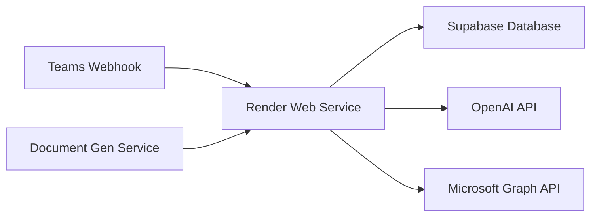

# 🚀 Deploying AI Employee on Render

This guide walks you through deploying the AI Employee system on Render.com.

## 📋 Prerequisites

- Render account
- Supabase account (for database)
- OpenAI API key
- Microsoft Graph API credentials (for Teams integration)

## 🏗️ Architecture on Render



## 📦 Deployment Steps

### 1. Prepare Your Repository

Create a `render.yaml` file in your project root:

```yaml
services:
  # Main Intent Service
  - type: web
    name: ai-employee-intent
    env: python
    buildCommand: "pip install -r requirements.txt"
    startCommand: "uvicorn services.intent_api.intent_v2:app --host 0.0.0.0 --port $PORT"
    envVars:
      - key: OPENAI_API_KEY
        sync: false
      - key: SUPABASE_URL
        sync: false
      - key: SUPABASE_KEY
        sync: false
      - key: DOCX_GEN_API_URL
        sync: false
      - key: PYTHON_VERSION
        value: 3.9.16

  # Document Generation Service
  - type: web
    name: ai-employee-docgen
    env: python
    buildCommand: "pip install flask python-docx openai"
    startCommand: "python services/document_gen_api.py"
    envVars:
      - key: OPENAI_API_KEY
        sync: false
      - key: PORT
        generateValue: true
```

### 2. Create Required Files

Create `services/document_gen_api.py` (combining your DOCX generation code):

```python
from flask import Flask, request, send_file, jsonify
from docx import Document
from docx.shared import Pt, Inches, RGBColor
from docx.enum.text import WD_ALIGN_PARAGRAPH
from docx.oxml import OxmlElement
from docx.oxml.ns import qn
import openai
import os
import tempfile
import re

openai.api_key = os.getenv("OPENAI_API_KEY")
app = Flask(__name__)

def gpt_markdown(raw_text: str) -> str:
    sys_msg = (
        "You return structured Markdown. Use:\n"
        "- # Title (once)\n"
        "- ## Section headings\n"
        "- Bullets starting with '- '\n"
        "- Short paragraphs\n"
        "Do NOT wrap in code-blocks."
    )
    usr_msg = f"Format the following:\n\n\"\"\"\n{raw_text}\n\"\"\""
    res = openai.chat.completions.create(
        model="gpt-4",
        messages=[{"role": "system", "content": sys_msg},
                  {"role": "user", "content": usr_msg}],
        temperature=0.5,
    )
    return res.choices[0].message.content.strip()

def _add_page_numbers(section):
    footer_p = section.footer.paragraphs[0]
    footer_p.alignment = WD_ALIGN_PARAGRAPH.CENTER
    run = footer_p.add_run()
    fld_begin = OxmlElement('w:fldChar')
    fld_begin.set(qn('w:fldCharType'), 'begin')
    instr = OxmlElement('w:instrText')
    instr.text = " PAGE "
    fld_end = OxmlElement('w:fldChar')
    fld_end.set(qn('w:fldCharType'), 'end')
    run._r.extend((fld_begin, instr, fld_end))

def markdown_to_docx(md: str, filename: str):
    doc = Document()
    sec = doc.sections[0]
    sec.top_margin = sec.bottom_margin = Inches(1)
    sec.left_margin = sec.right_margin = Inches(1)
    _add_page_numbers(sec)

    lines = md.splitlines()
    if lines and lines[0].startswith("# "):
        title = doc.add_heading(lines.pop(0)[2:].strip(), level=0)
        title.alignment = WD_ALIGN_PARAGRAPH.CENTER
        title.runs[0].font.size = Pt(22)
        title.runs[0].font.color.rgb = RGBColor(0x2E, 0x74, 0xB5)
        doc.add_paragraph("")

    for ln in lines:
        ln = ln.strip()
        if ln.startswith("## "):
            h = doc.add_heading(ln[3:], level=1)
            h.runs[0].font.color.rgb = RGBColor(0x00, 0x57, 0xA6)
        elif ln.startswith("- "):
            doc.add_paragraph(ln[2:], style="List Bullet")
        elif ln == "":
            doc.add_paragraph("")
        else:
            p = doc.add_paragraph(ln)
            p.style.font.size = Pt(11)

    doc.save(filename)

def extract_title(md: str) -> str:
    for line in md.splitlines():
        if line.startswith("# "):
            return line[2:].strip()
    return "ai_document"

def safe_filename(title: str) -> str:
    cleaned = re.sub(r'[^A-Za-z0-9 _-]', '', title)
    cleaned = cleaned.strip().replace(" ", "_")
    return (cleaned[:50] or "ai_document") + ".docx"

@app.route("/generate-docx", methods=["POST"])
def generate_docx():
    data = request.get_json(silent=True)
    if not data or "text" not in data:
        return jsonify({"error": "JSON body must contain 'text'"}), 400
    try:
        md = gpt_markdown(data["text"])
        title = extract_title(md)
        filename = safe_filename(title)

        with tempfile.NamedTemporaryFile(delete=False, suffix=".docx") as tmp:
            markdown_to_docx(md, tmp.name)
            return send_file(
                tmp.name,
                as_attachment=True,
                download_name=filename,
                mimetype="application/vnd.openxmlformats-officedocument.wordprocessingml.document",
            )
    except Exception as e:
        return jsonify({"error": str(e)}), 500

@app.route("/")
def root():
    return "✅ DOCX API running on Render"

if __name__ == "__main__":
    port = int(os.getenv("PORT", 5000))
    app.run(host="0.0.0.0", port=port)
```

### 3. Environment Variables Setup

In Render Dashboard, set these environment variables:

```bash
# Core Services
OPENAI_API_KEY=sk-...
SUPABASE_URL=https://your-project.supabase.co
SUPABASE_KEY=your-supabase-anon-key

# Microsoft Graph (for Teams)
# Note: You'll need to handle auth differently without Azure AD
# Consider using application permissions or delegated auth flow
GRAPH_CLIENT_ID=your-app-id
GRAPH_CLIENT_SECRET=your-app-secret
GRAPH_TENANT_ID=your-tenant-id

# Internal Service URLs (set after deployment)
DOCX_GEN_API_URL=https://ai-employee-docgen.onrender.com/generate-docx
```

### 4. Microsoft Graph Authentication Without Azure

Since you're not using Azure, you'll need to modify the authentication approach. Update `common/graph_auth.py`:

```python
import requests
import os
from datetime import datetime, timedelta

class GraphAuth:
    def __init__(self):
        self.client_id = os.getenv("GRAPH_CLIENT_ID")
        self.client_secret = os.getenv("GRAPH_CLIENT_SECRET")
        self.tenant_id = os.getenv("GRAPH_TENANT_ID")
        self.token = None
        self.token_expires = None
    
    def get_app_only_token(self):
        """Get application-only access token"""
        if self.token and self.token_expires > datetime.utcnow():
            return self.token
        
        url = f"https://login.microsoftonline.com/{self.tenant_id}/oauth2/v2.0/token"
        data = {
            "client_id": self.client_id,
            "client_secret": self.client_secret,
            "scope": "https://graph.microsoft.com/.default",
            "grant_type": "client_credentials"
        }
        
        response = requests.post(url, data=data)
        response.raise_for_status()
        
        token_data = response.json()
        self.token = token_data["access_token"]
        self.token_expires = datetime.utcnow() + timedelta(seconds=token_data["expires_in"] - 60)
        
        return self.token

# Global instance
graph_auth = GraphAuth()

def get_access_token():
    """Get access token for Graph API calls"""
    return graph_auth.get_app_only_token(), "app_only"
```

### 5. Deploy to Render

1. **Push to GitHub**:
   ```bash
   git add .
   git commit -m "Add Render deployment configuration"
   git push origin main
   ```

2. **Create New Web Service on Render**:
   - Go to Render Dashboard
   - Click "New +" → "Web Service"
   - Connect your GitHub repository
   - Render will auto-detect the `render.yaml`

3. **Configure Teams Webhook**:
   - Once deployed, your webhook URL will be:
     ```
     https://ai-employee-intent.onrender.com/webhook/v2
     ```
   - Configure this in your Teams app registration

### 6. Set Up Custom Domain (Optional)

In Render Dashboard:
1. Go to your service settings
2. Add a custom domain
3. Update DNS records as instructed
4. Update Teams webhook to use custom domain

### 7. Monitoring and Logs

Render provides built-in monitoring:
- View logs in Render Dashboard
- Set up health checks:
  ```python
  @app.get("/health")
  async def health_check():
      return {"status": "healthy", "timestamp": datetime.utcnow().isoformat()}
  ```

### 8. Scaling Considerations

For production use:
1. **Upgrade Render Plan**: Consider paid plans for:
   - More memory/CPU
   - Zero downtime deploys
   - Priority support

2. **Add Background Jobs**: For async tasks:
   ```yaml
   services:
     - type: worker
       name: ai-employee-worker
       env: python
       buildCommand: "pip install -r requirements.txt"
       startCommand: "python worker.py"
   ```

3. **Use Render Redis**: For caching:
   ```yaml
   services:
     - type: redis
       name: ai-employee-cache
       plan: starter
   ```

## 🔧 Troubleshooting

### Common Render Issues

1. **Build Failures**
   - Check Python version compatibility
   - Ensure all dependencies are in requirements.txt

2. **Port Binding**
   - Always use `$PORT` environment variable
   - Bind to `0.0.0.0` not `localhost`

3. **Memory Issues**
   - Monitor memory usage in Render Dashboard
   - Consider upgrading if hitting limits

4. **Cold Starts**
   - Free tier services sleep after inactivity
   - Consider paid plan for always-on service

## 🚨 Security Best Practices

1. **Environment Variables**
   - Never commit secrets to git
   - Use Render's secret management

2. **API Authentication**
   - Implement webhook signature validation
   - Use API keys for service-to-service calls

3. **Network Security**
   - Whitelist IPs if possible
   - Use HTTPS for all communications

## 📊 Performance Optimization

1. **Database Connections**
   - Use connection pooling
   - Set appropriate timeouts

2. **API Rate Limits**
   - Implement retry logic
   - Cache frequently accessed data

3. **Response Times**
   - Use async operations where possible
   - Implement request timeouts

## 🎯 Next Steps

1. **Set up monitoring alerts**
2. **Configure auto-scaling rules**
3. **Implement backup strategies**
4. **Plan for disaster recovery**

Remember: Render automatically handles SSL certificates and provides DDoS protection!
