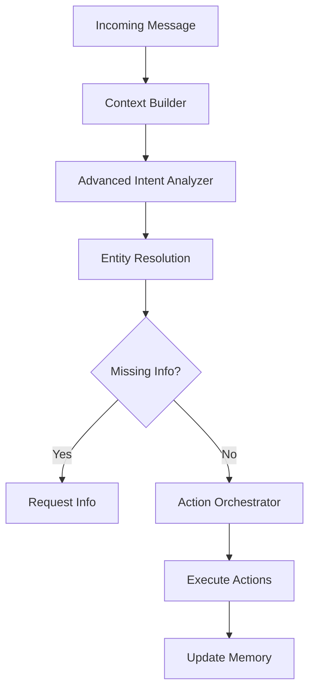

# 🤖 AI Employee - Autonomous Digital Assistant

An advanced AI-powered digital employee that monitors conversations, manages tasks, generates documents, and acts autonomously across Microsoft Teams, with planned support for Slack, Discord, and other platforms.

## 🚀 Features

### Core Capabilities

#### 1. **Smart Intent Detection & Multi-Step Actions**
- Advanced intent analysis with urgency and tone detection
- Multi-step action orchestration
- Entity resolution (contacts, documents, tasks)
- Automatic handling of missing information

#### 2. **Conversation Monitoring & Intelligent Responses**
- Continuous monitoring of Teams messages
- Context-aware responses using GPT-4
- Semantic search across conversation history
- Cross-chat memory and context

#### 3. **Task Management**
- Automatic task extraction from conversations ("I'll do it tomorrow")
- Task creation, assignment, and tracking
- Due date parsing and overdue notifications
- Integration-ready for Notion, Trello, ClickUp

#### 4. **Document Generation & Management**
- Generate professional documents from text or meeting summaries
- DOCX creation with proper formatting
- Document sharing via Teams/OneDrive
- Document search and retrieval

#### 5. **Email Automation**
- Smart email drafting and sending
- Contact resolution and management
- Missing information handling

#### 6. **Meeting Integration (Fireflies.ai)**
- Automatic meeting summary generation
- Action item extraction
- Decision tracking
- Document generation from meeting notes

### Planned Features

- 📅 Calendar management and proactive scheduling
- 📊 Automated reporting (daily/weekly summaries)
- 🧩 Multi-platform support (Slack, Discord, Google Workspace)
- 📈 Project planning and Gantt chart generation
- ⏱️ Time tracking and analytics
- 🔐 Configurable permissions and approval workflows

## 🏗️ Architecture

### Enhanced Intent System (v2)



### Key Components

1. **Intent Engine** (`services/intent_api/intent_v2.py`)
   - Advanced NLP-based intent detection
   - Multi-step action planning
   - Entity resolution and context management

2. **Unified Memory** (`common/unified_memory.py`)
   - Cross-domain entity search (contacts, documents, tasks)
   - Semantic memory with embeddings
   - Long-term context retention

3. **Specialized Agents**
   - **Email Agent**: Email composition and sending
   - **Reply Agent**: Conversational responses and contact management
   - **Document Agent**: Document generation and sharing
   - **Task Agent**: Task extraction and management

4. **Memory System**
   - PostgreSQL with pgvector for semantic search
   - Message history with embeddings
   - Entity relationships and cross-references

## 📋 Prerequisites

- Python 3.9+
- PostgreSQL with pgvector extension
- Supabase account (for database and vector storage)
- Microsoft 365 app registration (for Teams/Graph API)
- OpenAI API key
- Render account (for hosting)

## 🛠️ Installation

1. **Clone the repository**
   ```bash
   git clone https://github.com/your-org/ai-employee.git
   cd ai-employee
   ```

2. **Install dependencies**
   ```bash
   pip install -r requirements.txt
   ```

3. **Set up environment variables**
   ```bash
   # Create .env file with:
   OPENAI_API_KEY=your_openai_key
   SUPABASE_URL=your_supabase_url
   SUPABASE_KEY=your_supabase_key
   GRAPH_CLIENT_ID=your_microsoft_app_id
   GRAPH_CLIENT_SECRET=your_microsoft_app_secret
   GRAPH_TENANT_ID=your_tenant_id
   DOCX_GEN_API_URL=https://your-docgen-service.onrender.com/generate-docx
   ```

4. **Set up Supabase tables**
   ```sql
   -- Message history table
   CREATE TABLE message_history (
     id UUID PRIMARY KEY,
     chat_id TEXT NOT NULL,
     sender TEXT NOT NULL,
     content TEXT NOT NULL,
     chat_type TEXT,
     timestamp TIMESTAMPTZ NOT NULL,
     embedding vector(3072)
   );

   -- Contacts table
   CREATE TABLE contacts (
     id SERIAL PRIMARY KEY,
     created_at TIMESTAMPTZ DEFAULT NOW(),
     email TEXT UNIQUE NOT NULL,
     name TEXT,
     role TEXT,
     phone TEXT,
     conversation_id TEXT
   );

   -- Documents table
   CREATE TABLE documents (
     id UUID PRIMARY KEY,
     title TEXT NOT NULL,
     type TEXT NOT NULL,
     content TEXT,
     file_path TEXT,
     created_at TIMESTAMPTZ DEFAULT NOW(),
     metadata JSONB,
     meeting_id TEXT
   );

   -- Tasks table
   CREATE TABLE tasks (
     id UUID PRIMARY KEY DEFAULT gen_random_uuid(),
     description TEXT NOT NULL,
     assignee TEXT,
     due_date TIMESTAMPTZ,
     priority TEXT DEFAULT 'medium',
     status TEXT DEFAULT 'pending',
     chat_id TEXT,
     project_id TEXT,
     created_at TIMESTAMPTZ DEFAULT NOW(),
     metadata JSONB
   );

   -- Create indexes for better performance
   CREATE INDEX idx_message_history_chat_id ON message_history(chat_id);
   CREATE INDEX idx_tasks_assignee ON tasks(assignee);
   CREATE INDEX idx_tasks_status ON tasks(status);
   ```

5. **Set up pgvector RPC functions**
   ```sql
   -- Semantic search within a chat
   CREATE OR REPLACE FUNCTION match_messages_in_chat(
     chat_id TEXT,
     query_embedding vector(3072),
     match_count INT
   )
   RETURNS TABLE (sender TEXT, content TEXT)
   AS $$
   BEGIN
     RETURN QUERY
     SELECT m.sender, m.content
     FROM message_history m
     WHERE m.chat_id = $1
     ORDER BY m.embedding <=> $2
     LIMIT $3;
   END;
   $$ LANGUAGE plpgsql;

   -- Global semantic search
   CREATE OR REPLACE FUNCTION match_messages_global(
     query_embedding vector(3072),
     match_count INT
   )
   RETURNS TABLE (sender TEXT, content TEXT)
   AS $$
   BEGIN
     RETURN QUERY
     SELECT m.sender, m.content
     FROM message_history m
     ORDER BY m.embedding <=> $1
     LIMIT $2;
   END;
   $$ LANGUAGE plpgsql;
   ```

## 🚀 Running the Application

### Local Development

1. **Start the enhanced intent service**
   ```bash
   uvicorn services.intent_api.intent_v2:app --reload --port 8000
   ```

2. **Start the document generation service**
   ```bash
   python services/document_gen_api.py
   ```

### Production Deployment on Render

See [DEPLOYMENT_RENDER.md](DEPLOYMENT_RENDER.md) for detailed deployment instructions.

1. **Deploy to Render**
   - Push code to GitHub
   - Connect repository to Render
   - Deploy using the provided `render.yaml`

2. **Configure Teams webhook**
   - Set up a Teams app with webhook subscription
   - Point the webhook to `https://your-service.onrender.com/webhook/v2`

3. **Set environment variables in Render Dashboard**
   - All API keys and credentials
   - Service URLs after deployment

## 📝 Usage Examples

### Basic Commands

1. **Send an email**
   - "Send an email to Marc about the meeting summary"
   - AI will resolve Marc's contact, fetch/generate the summary, and send

2. **Create tasks**
   - "I'll finish the report by Friday"
   - AI extracts the task and creates it with appropriate due date

3. **Generate documents**
   - "Create a document summarizing today's discussion"
   - AI generates a formatted DOCX and shares it

4. **Manage contacts**
   - "Add john@company.com to contacts as John Smith"
   - AI creates/updates the contact

### Advanced Scenarios

1. **Multi-step actions**
   - "Send the meeting summary to all participants"
   - AI: Fetches meeting → Identifies participants → Generates summary → Sends emails

2. **Context-aware responses**
   - Uses semantic search to find relevant past conversations
   - Maintains context across chats and time

3. **Proactive task extraction**
   - Monitors conversations for commitments and action items
   - Automatically creates tasks without explicit commands

## 🔧 Configuration

### Intent Configuration

The intent system can be customized by modifying the prompt in `analyze_intent_advanced()`:

```python
# Add new intents
class Intent(str, Enum):
    # ... existing intents ...
    CUSTOM_ACTION = "custom_action"
```

### Adding New Agents

1. Create a new agent file in `services/intent_api/`
2. Implement the `process_[agent]_request()` function
3. Import and integrate in `intent_v2.py`

## 🤝 Contributing

1. Fork the repository
2. Create a feature branch (`git checkout -b feature/amazing-feature`)
3. Commit your changes (`git commit -m 'Add amazing feature'`)
4. Push to the branch (`git push origin feature/amazing-feature`)
5. Open a Pull Request

## 📄 License

This project is licensed under the MIT License - see the LICENSE file for details.

## 🙏 Acknowledgments

- OpenAI for GPT-4 API
- Supabase for vector database
- Microsoft Graph API for Teams integration
- Fireflies.ai for meeting transcription (integration pending)
